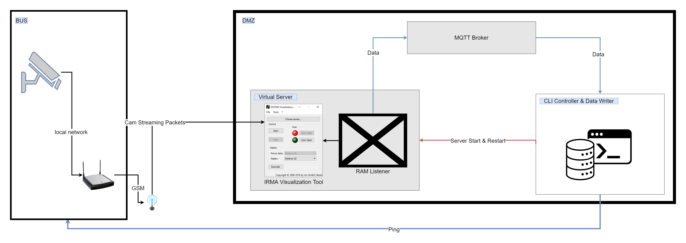
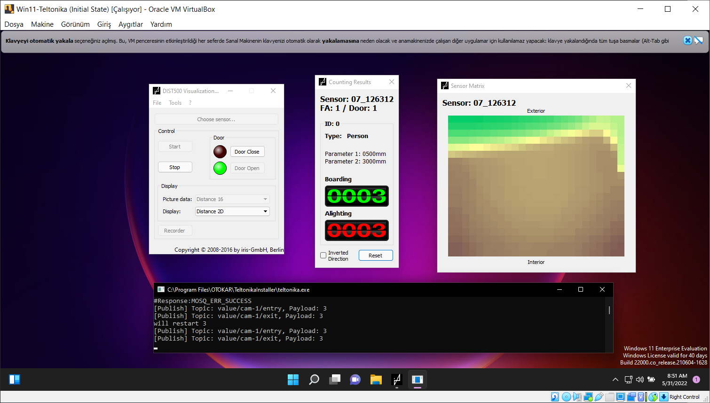

# Slave's Master Software

The purpose of this project is to enslave a software released as test software and share the data in it in order to be able to process it outside.

The software architecture of the project is given below



We will access the RAM area that stores the input and output values of the DIST500-Visualization software and share it with the outside in order to process this data via MQTT.

## Setup

Firstly ,setup must be installed on the virtual machine.
The snapshot of the virtual computer is taken as inital state so that the RAM regions do not change after the installations are performed.



## Necessary Virtual Box Commands,

- Restore Snapshot

```powershell
"C:\Program Files\Oracle\VirtualBox\VBoxManage" snapshot Win11-Teltonika restore "Initial State"
```

- Start VM without Header

```powershell
"C:\Program Files\Oracle\VirtualBox\VBoxManage" startvm Win11-Teltonika -type headless
```

- Start VM with Normal Window

```powershell
"C:\Program Files\Oracle\VirtualBox\VBoxManage" startvm Win11-Teltonika
```

- Poweroff VM

```powershell
"C:\Program Files\Oracle\VirtualBox\VBoxManage" controlvm Win11-Teltonika poweroff
```

- Take Screenshot

```powershell
"C:\Program Files\Oracle\VirtualBox\VBoxManage" controlvm Win11-Teltonika screenshotpng screenshot.png
```

## Project Dependencies

- C++ Boost Library

- Mosquitto MQTT Broker

## Compiling

### Additional Include Directories

- D:\Libraries\boost_1_79_0

- C:\Program Files\mosquitto\devel

### Additional Library Directories

- D:\Libraries\boost_1_79_0\libs

- C:\Program Files\mosquitto\devel

### Additional Dependencies

- mosquitto.lib


by BURAK BÜYÜKYÜKSEL
